# Diagramas DSS y Comunicacion

Proyecto: Plataforma de bienes raices.

El objetivo de este documento es dejar una version presentable de los Diagramas de Secuencia del Sistema (DSS) y Diagramas de Comunicacion para los casos de uso del laboratorio.

## Convenciones

- En los DSS el sistema se trata como caja negra. Solo aparecen `Administrador` y `:Sistema`.
- Las operaciones del DSS devuelven `Status`, datatypes o colecciones de datatypes.
- El sistema no devuelve objetos de dominio.
- En los Diagramas de Comunicacion si aparecen objetos internos para mostrar colaboraciones.
- Los nombres de operaciones son tentativos y pueden ajustarse a la interfaz final.

---

# Diagramas de Secuencia del Sistema

## DSS - Alta de Usuario

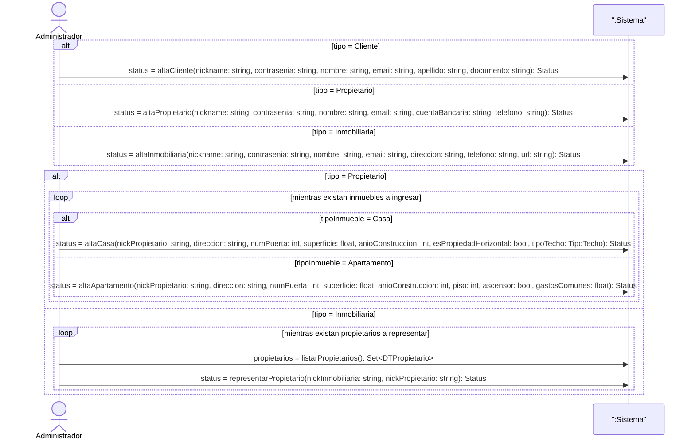

## DSS - Alta de Administracion de Propiedad

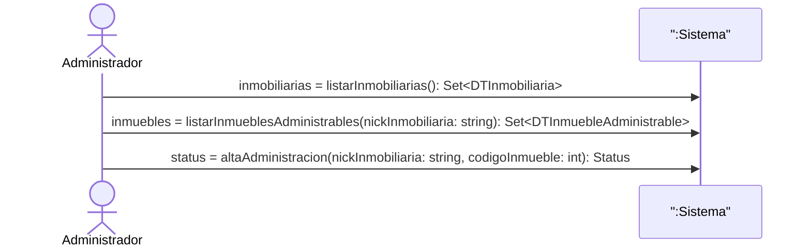

## DSS - Alta de Publicacion

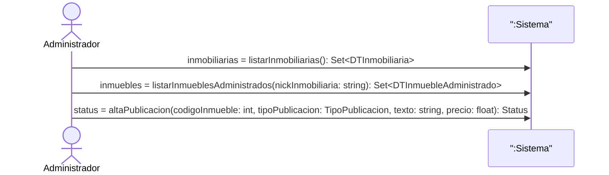

Nota: si la interfaz final no conserva seleccion de contexto, la operacion puede quedar como:

```text
status = altaPublicacion(nickInmobiliaria: string, codigoInmueble: int, tipoPublicacion: TipoPublicacion, texto: string, precio: float): Status
```

## DSS - Consulta de Publicaciones

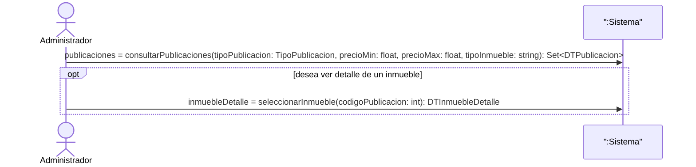

## DSS - Eliminar Inmueble

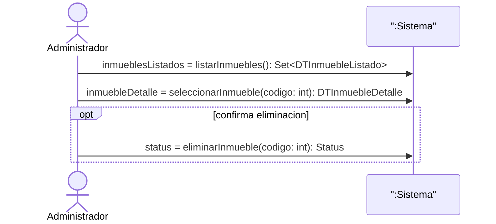

## DSS - Alta de Agenda de Visita

Este caso aparece en el dominio del Lab 1. No estaba desarrollado como caso de uso principal en Lab 2, pero se incluye porque forma parte del ciclo funcional implementado.

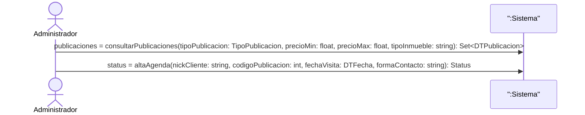

---

# Diagramas de Comunicacion

## Comunicacion - Alta Cliente

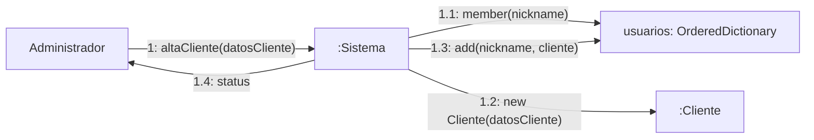

## Comunicacion - Alta Propietario

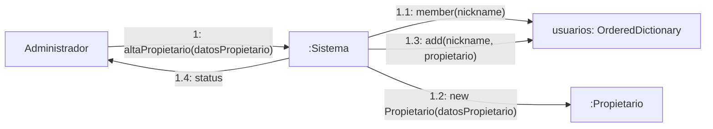

## Comunicacion - Alta Inmobiliaria

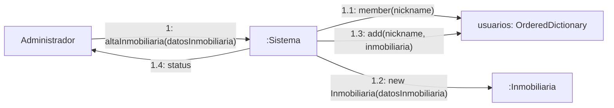

## Comunicacion - Alta Inmueble

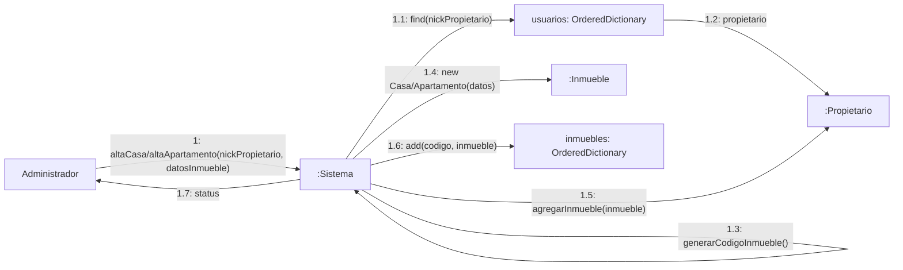

## Comunicacion - Representar Propietario

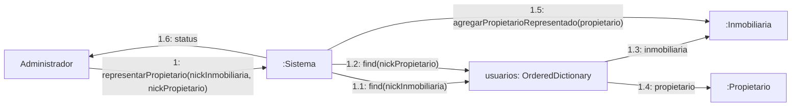

## Comunicacion - Listar Inmobiliarias

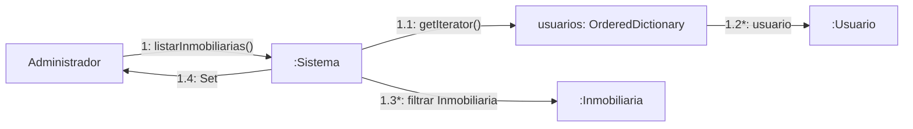

## Comunicacion - Alta Administracion de Propiedad

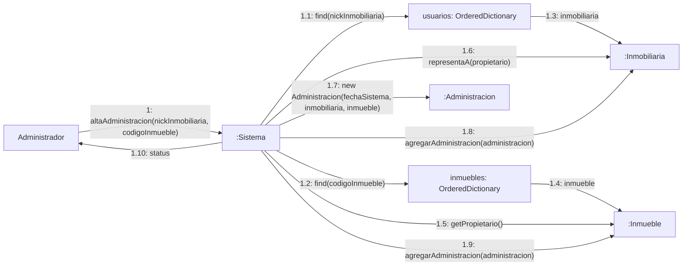

## Comunicacion - Listar Inmuebles Administrados

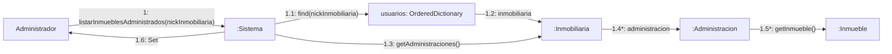

## Comunicacion - Alta Publicacion

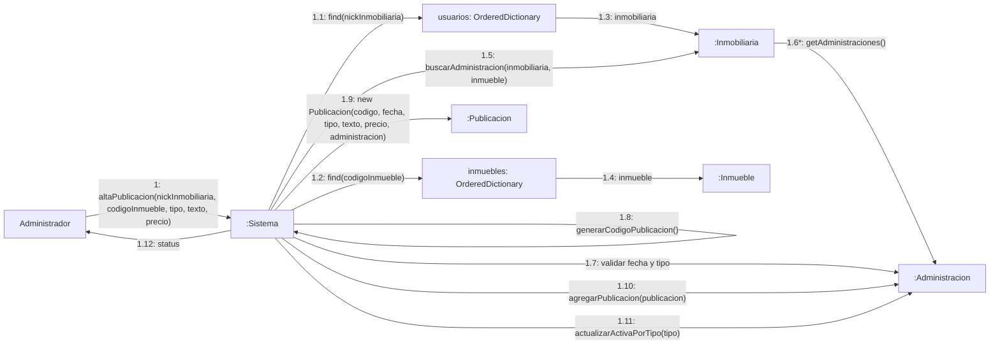

## Comunicacion - Consultar Publicaciones

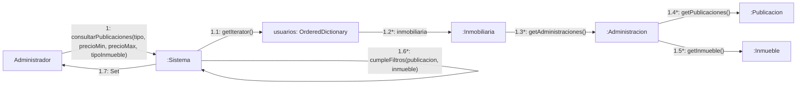

## Comunicacion - Ver Detalle de Inmueble

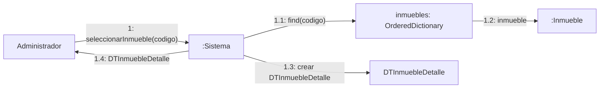

## Comunicacion - Alta Agenda

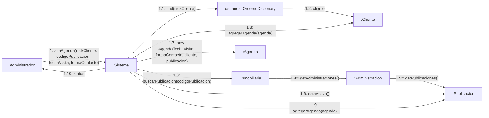

## Comunicacion - Eliminar Inmueble

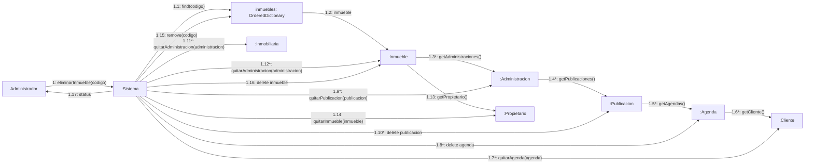

